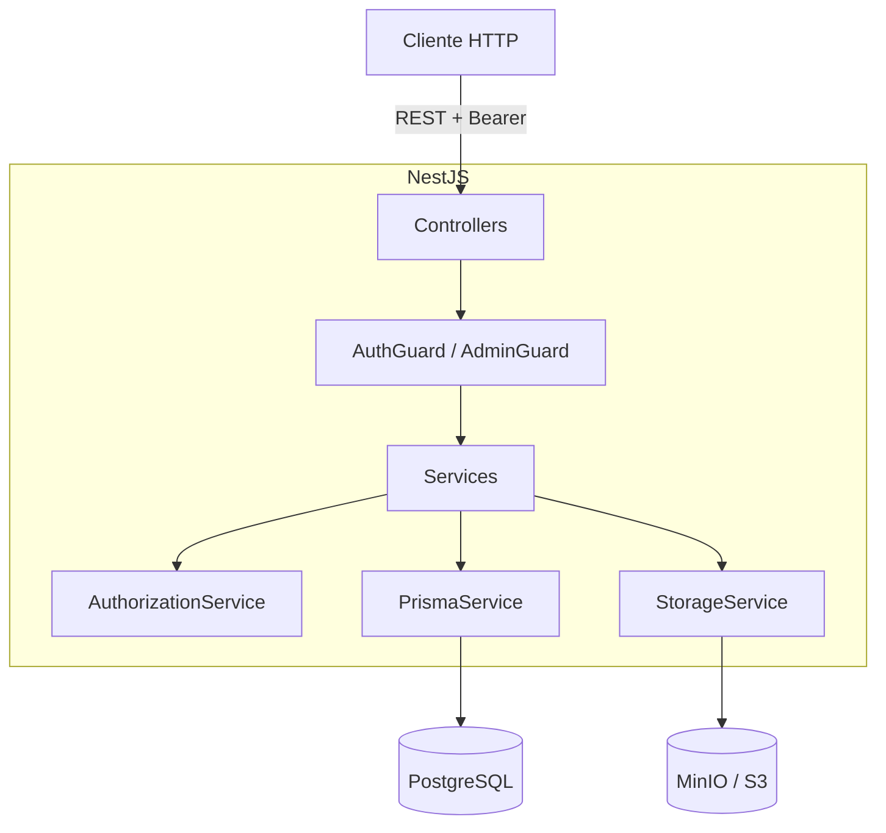

# Arquitectura del Backend

API REST construida con **NestJS 11** sobre **Node.js 26**, con **Prisma 7**
(adaptador `pg`) y **PostgreSQL 15**. Los archivos se guardan en **MinIO/S3**.
La especificación OpenAPI se publica con Swagger.

## Puesta en marcha

`src/main.ts` es el punto de entrada:

- Crea la app con `AppModule`.
- Registra un `ValidationPipe` global (`whitelist` + `transform`).
- Publica Swagger en `/api`.
- Escucha en `PORT` (por defecto `3001`).

`AppModule` importa los módulos de dominio y aplica el `LoggerMiddleware` a
todos los controladores.

## Capas

| Capa | Responsabilidad |
| --- | --- |
| **Controller** | Define rutas, valida DTOs y recibe al usuario autenticado. |
| **Guard** | `AuthGuard` valida el token; `AdminGuard` exige rol `admin`. |
| **Service** | Lógica de negocio, reglas de estado y mapeo de respuestas. |
| **AuthorizationService** | Centraliza las reglas de permisos (rol global + rol en proyecto). |
| **PrismaService** | Acceso a datos (cliente Prisma con adaptador `pg`). |
| **StorageService** | Abstracción de archivos; implementación `S3StorageService`. |

Los servicios devuelven **tipos de respuesta propios** (`ProjectDetailResponse`,
etc.) en vez de modelos crudos de Prisma, para no filtrar detalles de la BD.

## Módulos

- **Auth** — login, usuarios y roles.
- **Projects** — CRUD, actores y transición de estados.
- **Observations** — observaciones por proyecto.
- **Milestones** — hitos por proyecto.
- **Attachments** — anexos (subida, descarga y borrado).
- **Storage** — provee `StorageService` (S3/MinIO).

## Autenticación y autorización

El login (`POST /auth/login`) verifica la contraseña con **scrypt** y emite un
token **HMAC-SHA256** de 24 h (sin librerías externas). `AuthGuard` valida el
`Authorization: Bearer <token>` y carga el usuario en `request.user`.

Roles globales (`UserRole`): `admin`, `evaluator`, `coordinator`, `advisor`,
`student`. Roles dentro de un proyecto (`ActorRole`): `advisor`, `coordinator`,
`student`, `evaluator`.

`AuthorizationService` responde preguntas como "¿puede crear un proyecto?",
"¿puede gestionar este proyecto?" o "¿puede asignar actores?", combinando el
rol global con la asignación en el proyecto. El `admin` siempre pasa.

Al arrancar, `AuthService` crea un admin inicial si la base está vacía y
existen `INITIAL_ADMIN_EMAIL`, `INITIAL_ADMIN_PASSWORD` y `INITIAL_ADMIN_NAME`.

## Ciclo de vida del proyecto

Los estados son:

```
proposed → under_review → approved → assigned → in_progress → closed
```

`rejected` es terminal y puede alcanzarse desde cualquier estado activo. Las
transiciones se validan en `ProjectsService`; cada cambio se registra en
`ProjectStatusHistory` dentro de una transacción, exige un motivo (salvo para
`admin`) y respeta los permisos del rol que hace la transición.

## Modelo de datos (Prisma)

- **Usuario**: `User`, `UserRoleAssignment`.
- **Proyecto**: `Project`, `ProjectSchool`, `ProjectNaturalProposer`,
  `ProjectLegalProposer`.
- **Equipo y seguimiento**: `ProjectActorAssignment`, `ProjectObservation`,
  `ProjectStatusHistory`, `ProjectMilestones`.
- **Archivos**: `ProjectAttachment` (metadatos; el binario vive en S3/MinIO).

## Anexos

`AttachmentsController` recibe `multipart/form-data` con `FileInterceptor`
(almacenamiento en memoria). Límite de **10 MB** y lista blanca de MIME
(PDF, Word, Excel, PNG, JPEG). El servicio sube el archivo a S3 y, si falla el
registro en BD, lo elimina para no dejar huérfanos.

## Semillas y migraciones

En `prisma/`:

- `schema.prisma` y `migrations/` — esquema y migraciones.
- `seed.ts` + `seed/` — datos de ejemplo por dominio.
- `fixtures/` — datos JSON y archivos de anexos.

Comandos: `npx prisma migrate dev`, `npm run seed` (y variantes
`seed:users`, `seed:projects`, etc.).

## Endpoints principales

| Método | Ruta | Descripción |
| --- | --- | --- |
| `POST` | `/auth/login` | Iniciar sesión. |
| `GET/POST` | `/auth/users` | Listar / crear usuarios (admin). |
| `PATCH` | `/auth/users/:id/roles` | Reemplazar roles (admin). |
| `GET/POST` | `/projects` | Listar / crear proyectos. |
| `GET/PUT/DELETE` | `/projects/:id` | Detalle / editar / borrar. |
| `PATCH` | `/projects/:id/status` | Cambiar estado. |
| `POST` | `/projects/:id/actors` | Asignar actor. |
| `GET/POST` | `/projects/:id/observations` | Observaciones. |
| `GET/POST/PATCH/DELETE` | `/projects/:id/milestones` | Hitos. |
| `GET/POST/DELETE` | `/projects/:id/attachments` | Anexos. |
| `GET` | `/projects/:id/attachments/:aid/download` | Descargar anexo. |

## Diagrama


