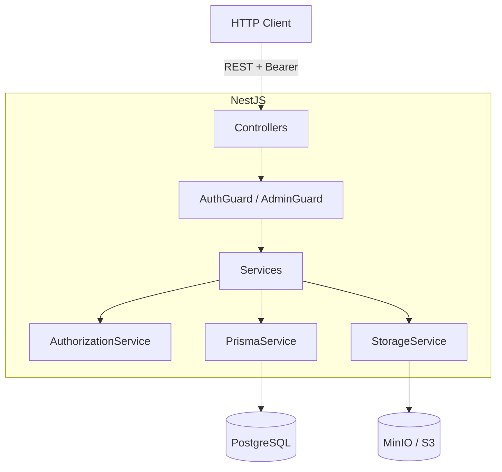

# Backend Architecture

REST API built with **NestJS 11** on **Node.js 26**, using **Prisma 7** (the
`pg` adapter) and **PostgreSQL 15**. Files are stored in **MinIO/S3**. The
OpenAPI spec is served with Swagger.

## Bootstrap

`src/main.ts` is the entry point:

- Creates the app from `AppModule`.
- Registers a global `ValidationPipe` (`whitelist` + `transform`).
- Serves Swagger at `/api`.
- Listens on `PORT` (default `3001`).

`AppModule` imports the domain modules and applies `LoggerMiddleware` to every
controller.

## Layers

| Layer | Responsibility |
| --- | --- |
| **Controller** | Defines routes, validates DTOs and receives the authenticated user. |
| **Guard** | `AuthGuard` validates the token; `AdminGuard` requires the `admin` role. |
| **Service** | Business logic, state rules and response mapping. |
| **AuthorizationService** | Centralizes permission rules (global role + project role). |
| **PrismaService** | Data access (Prisma client with `pg` adapter). |
| **StorageService** | File abstraction; implementation is `S3StorageService`. |

Services return **dedicated response types** (`ProjectDetailResponse`, etc.)
instead of raw Prisma models, so database details don't leak out.

## Modules

- **Auth** — login, users and roles.
- **Projects** — CRUD, actors and status transitions.
- **Observations** — observations per project.
- **Milestones** — milestones per project.
- **Attachments** — attachments (upload, download and delete).
- **Storage** — provides `StorageService` (S3/MinIO).

## Authentication and authorization

Login (`POST /auth/login`) verifies the password with **scrypt** and issues a
24-hour **HMAC-SHA256** token (no external libraries). `AuthGuard` validates
`Authorization: Bearer <token>` and loads the user into `request.user`.

Global roles (`UserRole`): `admin`, `evaluator`, `coordinator`, `advisor`,
`student`. Project-scoped roles (`ActorRole`): `advisor`, `coordinator`,
`student`, `evaluator`.

`AuthorizationService` answers questions like "can this user create a project?",
"can they manage this project?" or "can they assign actors?", combining the
global role with the project assignment. `admin` always passes.

On startup, `AuthService` creates an initial admin if the database is empty and
`INITIAL_ADMIN_EMAIL`, `INITIAL_ADMIN_PASSWORD` and `INITIAL_ADMIN_NAME` are
set.

## Project lifecycle

The states are:

```
proposed → under_review → approved → assigned → in_progress → closed
```

`rejected` is terminal and can be reached from any active state. Transitions
are validated in `ProjectsService`; every change is logged to
`ProjectStatusHistory` inside a transaction, requires a reason (except for
`admin`) and respects the permissions of the role making the transition.

## Data model (Prisma)

- **User**: `User`, `UserRoleAssignment`.
- **Project**: `Project`, `ProjectSchool`, `ProjectNaturalProposer`,
  `ProjectLegalProposer`.
- **Team and tracking**: `ProjectActorAssignment`, `ProjectObservation`,
  `ProjectStatusHistory`, `ProjectMilestones`.
- **Files**: `ProjectAttachment` (metadata only; the binary lives in S3/MinIO).

## Attachments

`AttachmentsController` receives `multipart/form-data` via `FileInterceptor`
(memory storage). Limit of **10 MB** and a MIME allowlist (PDF, Word, Excel,
PNG, JPEG). The service uploads the file to S3 and, if the DB insert fails,
deletes it to avoid orphans.

## Seeds and migrations

Under `prisma/`:

- `schema.prisma` and `migrations/` — schema and migrations.
- `seed.ts` + `seed/` — sample data per domain.
- `fixtures/` — JSON data and attachment files.

Commands: `npx prisma migrate dev`, `npm run seed` (and variants such as
`seed:users`, `seed:projects`, etc.).

## Main endpoints

| Method | Route | Description |
| --- | --- | --- |
| `POST` | `/auth/login` | Sign in. |
| `GET/POST` | `/auth/users` | List / create users (admin). |
| `PATCH` | `/auth/users/:id/roles` | Replace roles (admin). |
| `GET/POST` | `/projects` | List / create projects. |
| `GET/PUT/DELETE` | `/projects/:id` | Detail / edit / delete. |
| `PATCH` | `/projects/:id/status` | Change status. |
| `POST` | `/projects/:id/actors` | Assign actor. |
| `GET/POST` | `/projects/:id/observations` | Observations. |
| `GET/POST/PATCH/DELETE` | `/projects/:id/milestones` | Milestones. |
| `GET/POST/DELETE` | `/projects/:id/attachments` | Attachments. |
| `GET` | `/projects/:id/attachments/:aid/download` | Download attachment. |

## Diagram


