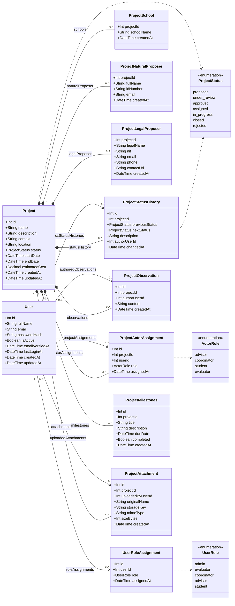

# Esquema de base de datos (Prisma)

La capa de datos es **PostgreSQL**, accedida mediante **Prisma 7**. La fuente
de verdad es `hub-backend/prisma/schema.prisma`; las migraciones viven en
`hub-backend/prisma/migrations/`.

Ver también: [Arquitectura del backend](./backend_arch.md).

## Enums

- `ProjectStatus`: `proposed`, `under_review`, `approved`, `assigned`,
  `in_progress`, `closed`, `rejected`.
- `UserRole`: `admin`, `evaluator`, `coordinator`, `advisor`, `student`.
- `ActorRole`: `advisor`, `coordinator`, `student`, `evaluator`.

## Entidades

### User

Cuenta y roles globales. `email` es único e `isActive` controla el acceso. Las
contraseñas se guardan como hash `scrypt`, nunca en texto plano.

### UserRoleAssignment

Tabla intermedia que da a un usuario uno o más roles globales. Única por
`(userId, role)`.

### Project

La entidad central. Contiene campos descriptivos, estado, fechas y costo
estimado, y es dueña de todos los registros relacionados mediante borrado en
cascada.

### ProjectSchool

Escuelas asociadas a un proyecto. Clave primaria compuesta
`(projectId, schoolName)`.

### ProjectNaturalProposer / ProjectLegalProposer

Datos opcionales del proponente: persona natural (`fullName`, `idNumber`,
`email`) o persona jurídica (`legalName`, `nit` único, `email`, `phone`,
`contactUrl`). Un proyecto tiene como máximo uno de cada uno (uno a uno vía
`projectId`).

### ProjectActorAssignment

Vincula un `User` con un `Project` mediante un `ActorRole`. Único por
`(projectId, userId)`.

### ProjectObservation

Comentarios de texto libre sobre un proyecto. El autor es opcional (`SetNull`
al eliminar el usuario).

### ProjectStatusHistory

Bitácora de cambios de estado: `previousStatus`, `nextStatus`, `description`
opcional y autor. Se escribe dentro de la misma transacción que la
actualización de estado.

### ProjectMilestones

Entregables programados con `title`, `description` opcional, `dueDate` y un
flag `completed`.

### ProjectAttachment

Metadatos de un archivo subido. El binario se almacena en S3/MinIO;
`storageKey` es único y apunta al objeto.

## Diagrama de clases UML

## Notas

- Todas las tablas propiedad de un proyecto usan cascada al borrar el
  proyecto, de modo que eliminarlo limpia sus filas dependientes.
- Las referencias a `User` usan `SetNull` cuando el registro debe sobrevivir al
  usuario (observaciones, historial de estado, anexos) y `Cascade` cuando no
  (asignaciones de rol y de actor).
- Hay índices declarados para los filtros comunes: `status`, `startDate` y
  `createdAt` del proyecto, además de claves foráneas y fechas usadas en los
  listados.
