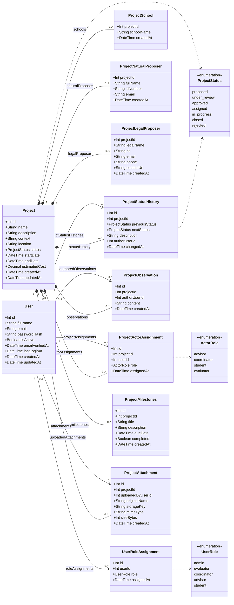

# Database Schema (Prisma)

The data layer is **PostgreSQL** accessed through **Prisma 7**. The source of
truth is `hub-backend/prisma/schema.prisma`; migrations live in
`hub-backend/prisma/migrations/`.

See also: [Backend architecture](./backend_arch.md).

## Enums

- `ProjectStatus`: `proposed`, `under_review`, `approved`, `assigned`,
  `in_progress`, `closed`, `rejected`.
- `UserRole`: `admin`, `evaluator`, `coordinator`, `advisor`, `student`.
- `ActorRole`: `advisor`, `coordinator`, `student`, `evaluator`.

## Entities

### User

Account and global roles. `email` is unique and `isActive` gates access.
Passwords are stored as a `scrypt` hash, never in plain text.

### UserRoleAssignment

Join table giving a user one or more global roles. Unique per
`(userId, role)`.

### Project

The central entity. Holds descriptive fields, status, dates and estimated
cost, and owns every related record through cascading deletes.

### ProjectSchool

Schools associated with a project. Composite primary key
`(projectId, schoolName)`.

### ProjectNaturalProposer / ProjectLegalProposer

Optional proposer data: a natural person (`fullName`, `idNumber`, `email`) or
a legal entity (`legalName`, unique `nit`, `email`, `phone`, `contactUrl`). A
project has at most one of each (one-to-one via `projectId`).

### ProjectActorAssignment

Links a `User` to a `Project` with an `ActorRole`. Unique per
`(projectId, userId)`.

### ProjectObservation

Free-text comments on a project. The author is optional (`SetNull` on user
delete).

### ProjectStatusHistory

Audit log of status changes: `previousStatus`, `nextStatus`, optional
`description` and author. Written inside the same transaction as the status
update.

### ProjectMilestones

Scheduled deliverables with `title`, optional `description`, `dueDate` and a
`completed` flag.

### ProjectAttachment

Metadata for an uploaded file. The binary is stored in S3/MinIO; `storageKey`
is unique and points to the object.

## UML class diagram

## Notes

- All project-owned tables cascade on project delete, so removing a project
  cleans up its dependent rows.
- References to `User` use `SetNull` where the record should survive the user
  (observations, status history, attachments) and `Cascade` where it should
  not (role and actor assignments).
- Indexes are declared for common filters: project `status`, `startDate` and
  `createdAt`, plus foreign keys and dates used in listings.
