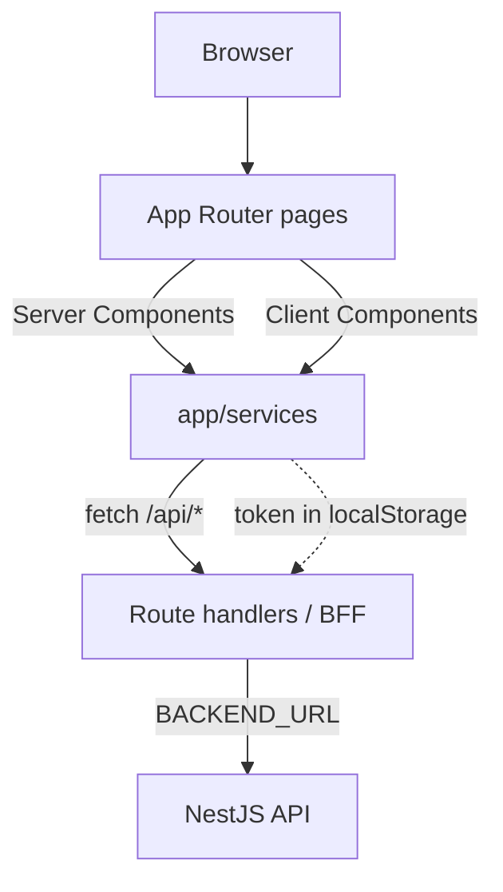

# Frontend Architecture

Web application built with **Next.js 16 (App Router)**, **React 19** and
**TypeScript**. Styling uses **Tailwind CSS v4** and components come from
**shadcn/ui** (Base UI + lucide-react). Tables are built with **TanStack
Table**.

## Layout

- `app/` — App Router routes.
- `app/api/` — route handlers acting as a BFF/proxy to the backend.
- `app/services/` — data access and session.
- `app/components/` — app-specific components (navbar, auth, forms).
- `components/ui/` — shadcn/ui base components.
- `lib/utils.ts` — utilities (e.g. `cn`).

## Routes

| Route | Screen |
| --- | --- |
| `/` | Home. |
| `/login` | Sign in. |
| `/projects` | Project list. |
| `/projects/[id]` | Detail with tabs (general, team, milestones, attachments, history). |
| `/submit`, `/submit/natural` | Project proposal. |
| `/admin/users` | User and role management. |

## BFF pattern (Backend For Frontend)

The browser never calls the backend directly. Each `app/api/.../route.ts`
receives the request, forwards the `Authorization` header and `fetch`es
`BACKEND_URL` (default `http://localhost:3001`), returning the response as-is.
This avoids CORS and hides the backend URL.

`app/api/auth/proxy.ts` is a reusable helper for login and users.

## Services layer

`app/services/` concentrates all API communication:

- `auth.ts` — session in `localStorage` (`capstonehub.auth.session`) and
  login/user functions.
- `projects.ts` — projects, milestones, observations and attachments.
- `schemas.ts` — shared TypeScript types (`ProjectDetails`, etc.).
- `utils.ts` — formatting helpers (statuses, dates).

Every authenticated request reads the token from `auth.ts` and adds
`Authorization: Bearer <token>`.

## Authentication

`AuthProvider` (client) holds the session and exposes it through context
(`useAuth`). Login stores the user + token in `localStorage`; services read the
token when making requests. There are no cookies or server-side sessions.

## Server vs Client Components

- Pages fetch data with Server Components (`getProjects`, `getProjectById`)
  using `cache: "no-store"`.
- Interactivity (project table, detail panels, user dialogs) lives in Client
  Components with `"use client"`.

## Configuration and deployment

- `BACKEND_URL` variable for the proxy.
- `NEXT_PUBLIC_SITE_URL` as the API base when calling from the client.
- Multi-stage Docker build with *standalone* output, exposed on port `3000`.

## Diagram

