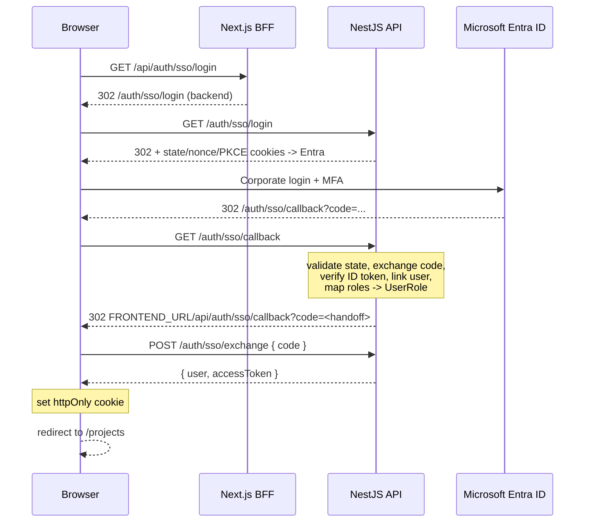

# SSO with Microsoft Entra ID

Plan to add corporate single sign-on on top of the existing auth, without
replacing it. See [backend architecture](./backend_arch.md) and
[frontend architecture](./frontend_arch.md) for the current auth design.

## Goal

Let users sign in with their existing **corporate Microsoft accounts**. The
project connects to the corporate identity provider as a client; it never
stores or copies corporate credentials. Local email/password login keeps
working (hybrid), and the project's database only stores app-specific profile
data linked to the corporate identity.

## Confirmed approach

The corporate system exposes **OpenID Connect** (the authorize URL looks like
`https://login.microsoftonline.com/<tenant>/oauth2/v2.0/authorize?...&scope=openid`,
which is Entra ID's OIDC/OAuth2 endpoint — not SAML).

Decisions as agreed:

| Decision | Choice |
| --- | --- |
| Login modes | Hybrid: SSO + existing email/password |
| User provisioning | Auto-provision on first login |
| Role source | Entra **App Roles** mapped to `UserRole` |
| Session transport | Migrate to **httpOnly cookies** via the Next.js BFF |
| OIDC client | **NestJS backend** (confidential client) |
| App registration | Created by **corporate IT** |

## Flow



The NestJS backend remains the OIDC client and the issuer of the existing
HMAC-SHA256 app token; only the transport changes (httpOnly cookie instead of
`localStorage`).

## What to request from corporate IT

The integration is blocked until IT delivers the following. This is the
"contract" with the corporate side.

- **App registration**, single-tenant, in the corporate tenant.
  Return: `Tenant ID`, `Client ID`.
- **Auth credential**: a client secret, or preferably a certificate. If
  neither is allowed, the fallback is a public client with PKCE.
- **Redirect URIs** (Web platform):
  - production `https://<domain>/auth/sso/callback`
  - local dev `http://localhost:3001/auth/sso/callback` (Entra allows
    `http://localhost` as an exception to the HTTPS rule)
- **App roles** defined and assigned to users and/or groups:
  `admin`, `evaluator`, `coordinator`, `advisor`, `student`. Assigning to
  groups is fine; members still receive the `roles` claim.
- **Admin consent** for the `openid profile email` scopes.
- **Token configuration**: emit `email` / `preferred_username` and the
  `roles` claim.
- Optional: a **front-channel logout URI** for single sign-out.

Open items to confirm with IT:

- Client credential type (secret vs certificate) — affects the implementation.
- Whether the localhost redirect URI is allowed (otherwise local testing needs
  a tunnel or a separate dev app registration).

## Environment variables

New backend variables (`hub-backend/.env.example`, `compose.yml`):

```
AZURE_TENANT_ID=""
AZURE_CLIENT_ID=""
AZURE_CLIENT_SECRET=""        # or certificate settings
AZURE_REDIRECT_URI="http://localhost:3001/auth/sso/callback"
FRONTEND_URL="http://localhost:3000"
SSO_ALLOWED_DOMAINS=""        # optional allowlist, comma-separated
SSO_DEFAULT_ROLE="student"    # fallback when no app role is present
```

New frontend variables only if needed for the BFF cookie name / site URL.

## Data model changes

`User` gains an external identity link. Passwords become optional so
auto-provisioned SSO users have no hash. Full schema in
[database_arch.md](./database_arch.md).

```prisma
enum AuthProvider {
  local
  microsoft
}

model User {
  // ...
  passwordHash   String?      @map("password_hash") @db.VarChar(255)
  entraObjectId  String?      @unique(map: "uk_user_entra_object_id") @map("entra_object_id") @db.VarChar(255)
  authProvider   AuthProvider @default(local) @map("auth_provider")
  // ...
}
```

A migration drops `NOT NULL` on `password_hash` and adds the new columns.
`entraObjectId` stores the `oid` claim (stable within the tenant).

## Backend changes

Dependency: `openid-client` (framework-agnostic OIDC client; no Passport in the
project today).

New routes in the auth module:

| Method | Route | Description |
| --- | --- | --- |
| `GET` | `/auth/sso/login` | Start OIDC: state/nonce/PKCE in short-lived httpOnly cookies, 302 to Entra. |
| `GET` | `/auth/sso/callback` | Validate state, exchange code, verify ID token, provision user, mint one-time handoff code, 302 to frontend. |
| `POST` | `/auth/sso/exchange` | Validate the handoff code, return `{ user, accessToken }`. |
| `GET` | `/auth/me` | Behind `AuthGuard`; returns the current user for the BFF. |

`AuthService` changes:

- `login`: reject when `passwordHash` is `null`.
- `provisionExternalUser(profile)`: match by `entraObjectId`, then normalized
  `email`; create if missing; enforce allowed domain/tenant; map the `roles`
  claim to `UserRole` (default `SSO_DEFAULT_ROLE`); update `fullName` and
  `lastLoginAt`.
- Reuse `createAccessToken`; `AuthGuard` and the app token stay unchanged.

Validation: rely on `openid-client` discovery to validate `iss`, `aud`, `nonce`
and signature against the tenant JWKS, and additionally check the `tid` equals
`AZURE_TENANT_ID`.

Multi-instance note: the one-time handoff code should be a short-TTL signed
value (stateless) or use a shared store (Redis) instead of an in-process map.

## Frontend changes (BFF / cookie migration)

Do this migration **first**, independently of the corporate dependency, so the
password login works over cookies before SSO is added.

- `app/api/auth/login/route.ts`: on success set an httpOnly, `Secure`,
  `SameSite=Lax` session cookie and return the user only (no token in the body).
- New `app/api/auth/logout/route.ts` (clear cookie) and
  `app/api/auth/me/route.ts`.
- Shared `app/api/proxy.ts` and `app/api/auth/proxy.ts`: read the session
  cookie via Next's `cookies()` helper and forward it as `Authorization:
  Bearer` instead of trusting the client header.
- `app/services/auth.ts`: remove `localStorage`; `app/components/auth-provider.tsx`:
  hydrate from `/api/auth/me`, login/logout via route handlers, drop the
  `storage` event listener.
- New `app/api/auth/sso/login/route.ts` (redirect to the backend) and
  `app/api/auth/sso/callback/route.ts` (exchange code, set cookie, redirect).
- `app/login/login-form.tsx`: add a shadcn "Iniciar sesión con Microsoft"
  button pointing at `/api/auth/sso/login`.

CSRF baseline: same-origin BFF routes plus `SameSite=Lax` block cross-site
POSTs. Add a CSRF token if mutations ever need to be cross-site.

Per `hub-frontend/AGENTS.md`, read `node_modules/next/dist/docs/` before coding
the BFF routes, since Next.js 16 may have changed the `cookies()` API.

## Role mapping

Entra **App Roles** are emitted as the `roles` claim in the ID token and map
1:1 to `UserRole` values. Choose this over group claims because group-based
tokens hit the >5-group overage limit and would require a Microsoft Graph call.

- Role present -> assign the matching `UserRole`.
- No role claim -> `SSO_DEFAULT_ROLE`.
- Admins can still override roles in the existing admin UI, which manages
  `UserRoleAssignment` and is unchanged.

## Phases

| Phase | Scope | Depends on IT? |
| --- | --- | --- |
| 0 | Request app registration; add env vars. | Yes (blocking) |
| 1 | Prisma migration; backend SSO endpoints; `/auth/me`. | Redirect URL known |
| 2 | Frontend cookie/BFF migration for password login. | No |
| 3 | SSO button + BFF callback + role mapping. | Yes |
| 4 | Hardening, tests, docs. | — |

Request the app registration from IT now; Phases 1 and 2 can proceed in
parallel once the tenant ID and redirect URI are known.

## Testing and verification

- Backend unit tests: SSO provisioning (new vs returning user, role mapping,
  null-password login), mocking `openid-client`.
- Regression: existing `auth.service.spec.ts`, `auth.guard.spec.ts`, admin user
  CRUD, and all proxy routes still pass.
- Manual E2E against a dev Entra tenant: full redirect, cookie set, `/auth/me`,
  role claim, sign-out.
- Commands: backend `npm run lint`, `npm test`; frontend `npm run lint`,
  `npm run build`.

## Risks

- **Lead time**: app registration and admin consent are the critical path.
- **Secret handling**: credentials must reach the deploy env, never the repo.
  If IT won't issue a secret, use PKCE/certificate.
- **Localhost redirect**: without it, local testing needs a tunnel or a dev app
  registration.
- **Role assignment**: if IT won't define app roles, fall back to a default role
  plus manual assignment in the admin UI.
- **Group overage**: avoided by using app roles instead of group claims.
- **Next.js 16 API drift**: confirm the `cookies()` signature before coding.
